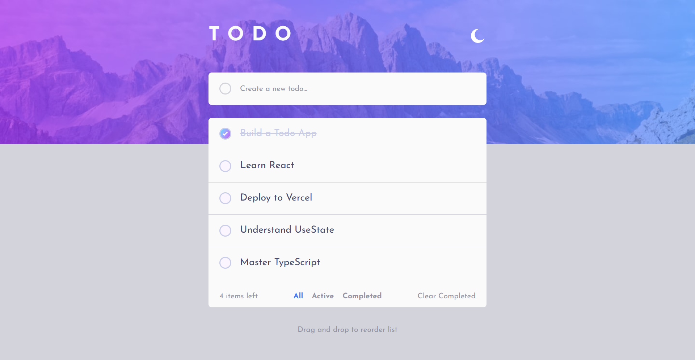

# Frontend Mentor - Todo app solution

This is a solution to the [Todo app challenge on Frontend Mentor](https://www.frontendmentor.io/challenges/todo-app-Su1_KokOW). Frontend Mentor challenges help you improve your coding skills by building realistic projects. 

## Table of contents

- [Overview](#overview)
  - [The challenge](#the-challenge)
  - [Screenshot](#screenshot)
  - [Links](#links)
- [My process](#my-process)
  - [Built with](#built-with)
  - [What I learned](#what-i-learned)
  - [Continued development](#continued-development)
  - [Useful resources](#useful-resources)
- [Author](#author)

## Overview

### The challenge

Users should be able to:

- View the optimal layout for the app depending on their device's screen size
- See hover states for all interactive elements on the page
- Add new todos to the list
- Mark todos as complete
- Delete todos from the list
- Filter by all/active/complete todos
- Clear all completed todos
- Toggle light and dark mode
- **Bonus**: Drag and drop to reorder items on the list

### Screenshot



### Links

- Solution URL: [https://www.frontendmentor.io/solutions/todo-app-using-dnd-kit-t_HK6l-4sN](https://www.frontendmentor.io/solutions/todo-app-using-dnd-kit-t_HK6l-4sN)
- Live Site URL: [https://aiy7788.github.io/todo-app/](https://aiy7788.github.io/todo-app/)

## My process

### Built with

- Semantic HTML5 markup
- CSS custom properties
- Flexbox
- CSS Grid
- Mobile-first workflow
- Dnd-kit
- React (Vite)
- TypeScript

### What I learned

```tsx
const handleDragEnd = (event: DragEndEvent) => {
  const { active, over } = event;

  if (!over || active.id === over.id) return;

  const oldIndex = filteredData.findIndex((t) => t.id === active.id);
  const newIndex = filteredData.findIndex((t) => t.id === over.id);

  setTodos(arrayMove(filteredData, oldIndex, newIndex));
};

<DndContext collisionDetection={closestCenter} onDragEnd={handleDragEnd}>
  <SortableContext
    items={filteredData.map((t) => t.id)}
    strategy={verticalListSortingStrategy}
  >
    <ul className="h-77.5 overflow-y-auto overflow-x-hidden scrollbar-thin scrollbar-track-gray-600 scrollbar-thumb-primary dark:scrollbar-track-purple-700 scrollbar-thumb-rounded-xl scrollbar-track-rounded-2xl scrollbar-hover:cursor-grab">
      {filteredData.map((item) => (
        <SortableItem key={item.id} item={item} />
      ))}
    </ul>
  </SortableContext>
</DndContext>
```
### Continued development

Practice optimistic updates with a real backend API

### Useful resources

- [dndkit](https://dndkit.com/overview) - This helped me for Drag and drop to reorder items on the list

## Author

- Frontend Mentor - [@AIY7788](https://www.frontendmentor.io/profile/AIY7788)

